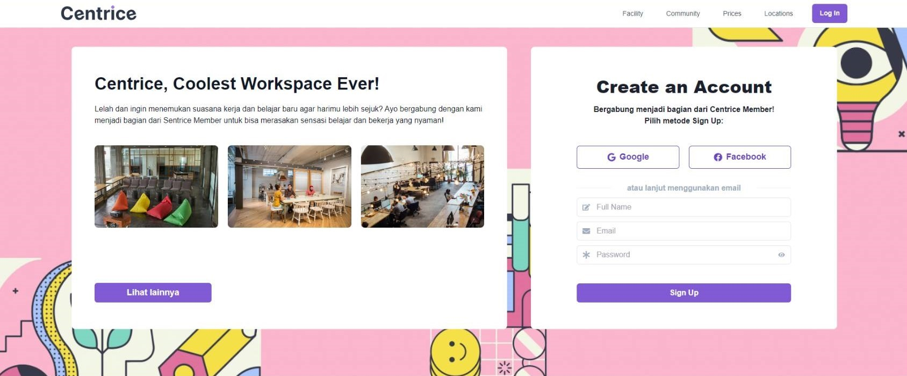
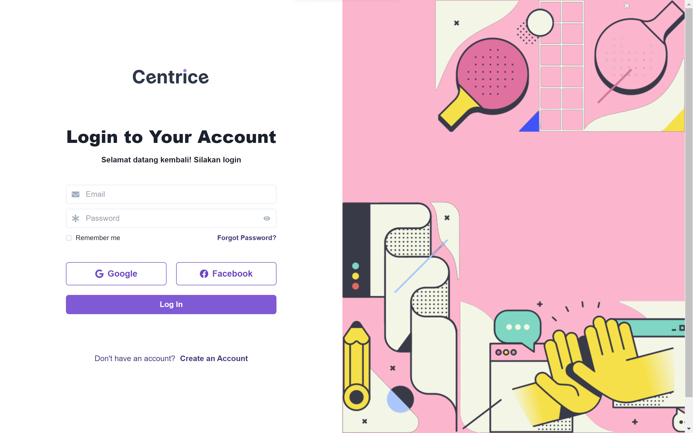
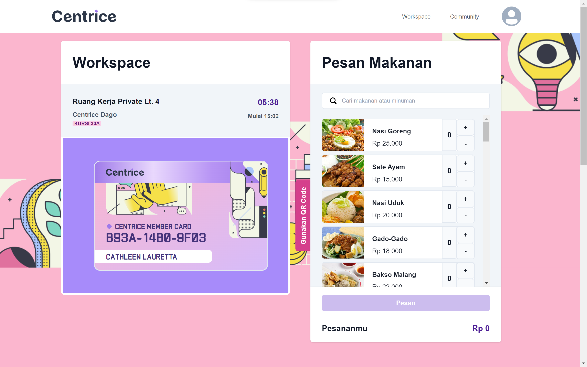
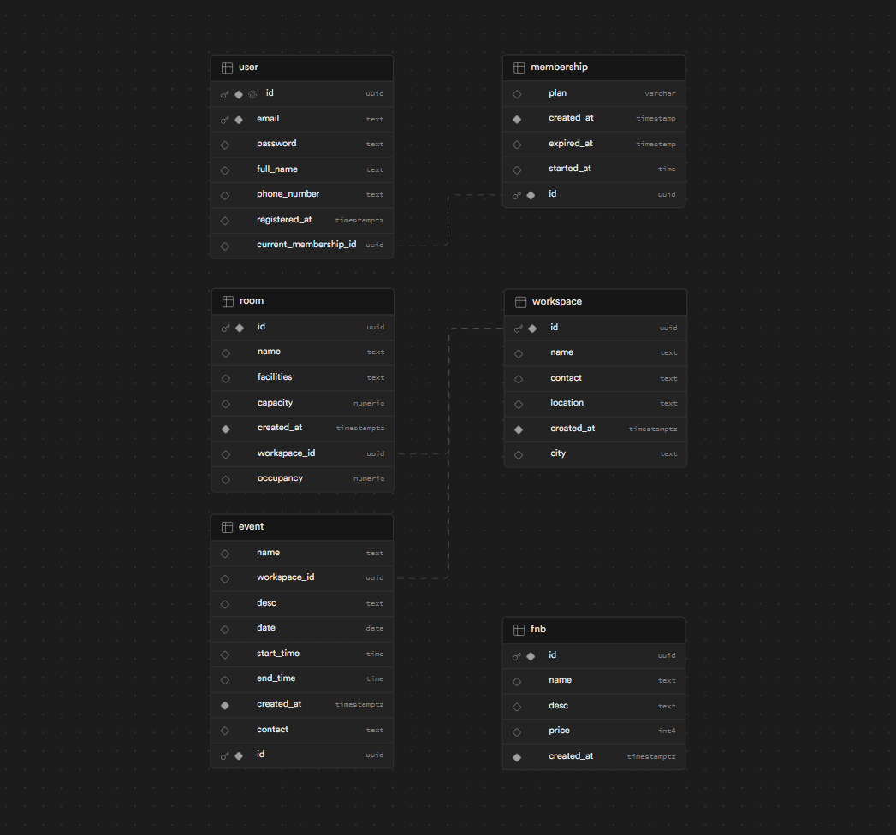

## II3120 - Information System Technology Services

<center>
CENTRICE is an automated system for coworking space services, such as registration and ordering, to make the process become more simple and efficient.
</center>

## Table of Content
- [Requirements](#requirements)
- [How to Run the Program](#how-to-run-the-program)
- [Program Usage Guide](#program-usage-guide)
- [Database Schema](#database-schema)
- [Progress Report](#progress-report)
- [Authors](#authors)

## Requirements
- [NodeJS](https://nodejs.org/en/download)

## How to Run the Program
1. Clone this repository
    ```bash
    git clone https://github.com/cathlauretta/ii3120-smart-coworking-space
    ```
2. Change the directory to the cloned repository
    ```bash
    cd ii3120-smart-coworking-space
    ```
3. Install the required dependencies/package
    ```bash
    npm install
    ```
4. Run the program
    ```bash
    npm run dev
    ```
5. Open the application on ``localhost:3000`` or access the program from this link [Smart Centrice](https://smart-centrice.vercel.app/)

## Program Usage Guide

This is the landing page of the program when it is started. Guest can scroll down the page to read more information about the coworking space, such as facility, community, prices, and locations.


If a guest wants to order coworking space room or see our menus, guest must create an account and log in to our website.


After login, this page will show the coworking space room and list of menu to order in the coworking space area.

## Database Schema
Below are the database schema used in the program. There are six tables: user, membership, workspace, room, event, and fnb that stores different attributes/informations and some refer to another attribute in another table. 



## Progress Report
| Implementation | Done |
|---|---|
| User can register themself | &check; |
| User can log in | &check; |
| User can subscribe membership | &cross; |
| User can book a room | &cross; |
| User can order menu | &cross; |
| User can do payment | &cross; |

## Authors
| Student ID | Name |
|---|---|
| 18221121 | Rozan Ghosani |
| 18221149 | Rayhan Nugraha Putra |
| 18221157 | Cathleen Lauretta |
| 18221171 | Hans Stephano Edbert N |
| 18221173 | Naura Valda Prameswari |
